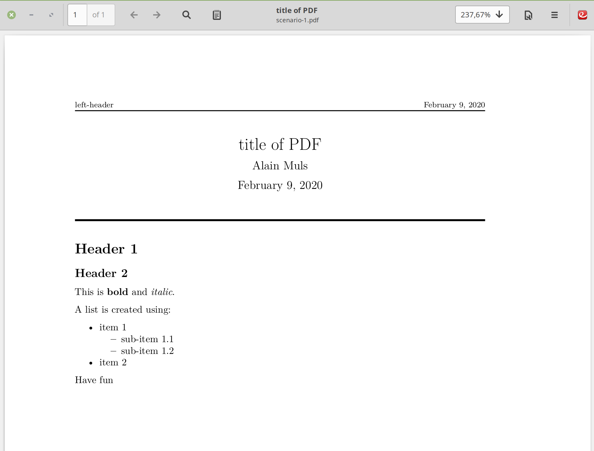

# Installation Markdown / Pandoc for Sublime Text

## `Github` local repository

Make sure you have following software installed:

- `pandoc`: install using `sudo apt install pandoc`
- `texlive-full`: install using `sudo apt install texlive-full`
- `sublime text 3`: : install using `sudo apt install sublime-text`

The installation is done on `Linux Mint 19.1` with `Cinnamon v4.10.0` but any `Ubuntu` installation should have equivalent settings.

Download and install the `github` repository `ammarkdown` in a directory (I installed under `${HOME}/.config`) using the command:

> git clone https://github.com/alainmuls/ammarkdown.git

The obtained directory structure is represented in figure @fig:tree.

{#fig:tree}

## Linking from `sublime-text-3`

Next we need to create the appropriate links.

1. Go to directory `${HOME}/.config/sublime-text-3/Packages/User/snippets/` and create soft links:

    > ln -sf ~/.config/ammarkdown/snippets/* .

1. Go to directory `${HOME}/.config/sublime-text-3/Packages/User/` and create soft links:

    > ln -sf ~/.config/ammarkdown/builds/@* .

1. Go to directory `${HOME}/.pandoc/templates/` and create soft links:

    > ln -sf ~/.config/ammarkdown/templates/* .

## Using the `snippets` and `builds` scripts

From `sublime-text-3`, or short `subl`, open a new file and save it with the extension `.md` in a directory of your project. As an example do:

> mkdir ~/project
>
> cd ~/project
>
> subl
>
> >Ctrl-n>  # creates a new unnamed file
>
> >Ctrl-s>  # opens the file dialog for saving
>
> (type) scenario-1.md  # and save the file

We can now use the `snippets` to start working creating the `markdown` structure of the document. The following snippets are available (`yaml` stand for _Yet Another Markup Language_):

1. `yamlmom` used for creating the MoM of a meeting
2. `yamlpdf` used for creating a `PDF` document

Type either `yamlpdf` or `yamlmom` followed by `<tab>`, you get the following inserted (for `yamlpdf`) (Figure @fig:yamlpdf). By pressing `<tab>` one goes through different highlighted fields in the `yaml` header which you can easily adapt for the current task.

{#fig:yamlpdf}

Once the `yaml` header is finished, you can start editing the document.

For compiling and getting the output you go to `Tools` - `Build System` and select either `@PDF` or `@DOCX`. Press `<Ctrl-b>` and the corresponding `PDF` or `DOCX` file will be created (Figure @fig:pdf-outpu).

{#pdf-aoutput}

